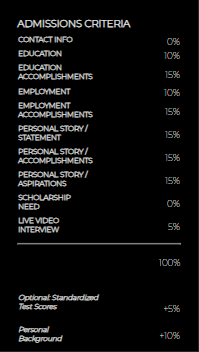

# Vida Admissions Criteria

## License

    This project is licensed with MIT.

## Description

This is a one page react app that displays just one component of an organization's admissions critera.

## Table of Contents

1. [License](#license)
2. [Installation](#installation)
3. [Tests](#tests)
4. [Contributing](#contributing)
5. [Questions](#questions)

## Screenshots: 

## Installation

npm i

## Tests

npm run test

## Contributing

Simply run npm i for dependencies and then run npm start from the client directory.

## Questions

Questions?

You may reach me by email at: <eaim928@gmail.com>

You may also reach me on github: <https://github.com/gim928>
